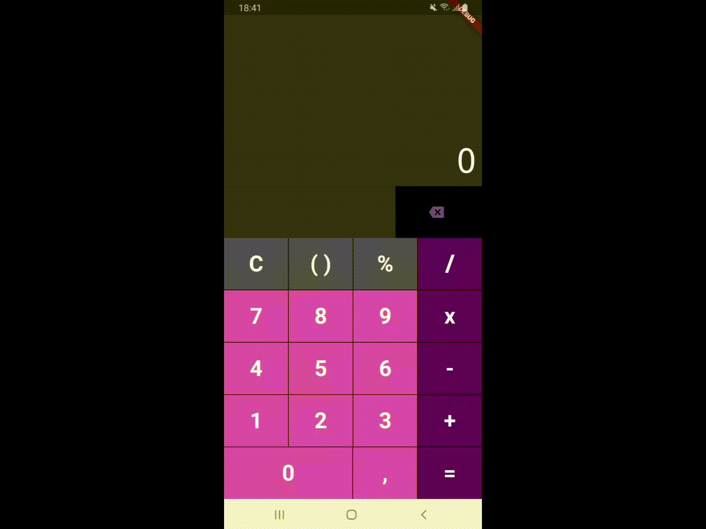

# 📱 Calculadora em Flutter

Este projeto é uma calculadora simples desenvolvida em Flutter, inspirada na calculadora da Samsung. Ele foi criado com o objetivo de aprender e consolidar conceitos fundamentais do desenvolvimento mobile com Flutter.

## 🚀 Tecnologias Utilizadas

- **Flutter**
- **Dart**
- **SQLite** (com `sqflite` para persistência de dados)

## 🔹 Funcionalidades

- Realização de operações matemáticas básicas (+, -, *, /);
- Exibição do resultado na tela;
- Armazenamento do histórico das operações no banco de dados SQLite;
- O banco de dados é armazenado na pasta `/Armazenamento Interno/calculator/data/calculator.db3`;
- Layout responsivo adaptado a diferentes tamanhos de tela;

## ⏭ Próximos Passos

- Implementar um botão para visualizar o histórico de cálculos armazenados
- Criar uma rotina de manutenção para limpeza dos dados antigos

## 📸 Capturas de Tela



## 🔧 Como Executar o Projeto

- O projeto foi desenvolvido somente para android;
- É necessário instalar o android sdk;

### Clonando e Configurando:

```bash
# Clone este repositório
$ git clone https://github.com/aricoelhog/calculator.git

# Acesse a pasta do projeto
$ cd calculator

# Instale as dependências
$ flutter pub get

# Cria o arquivo memory_store.g.dart que realiza a persistência de dados
$ flutter packages pub run build_runner build

# Antes de realizar alterações no código:
$ flutter packages pub run build_runner watch
```

### Debug:

```bash
# Para iniciar a depuração:
$ flutter run --debug

# Se houver vários dispositivos conectados:
$ flutter devices
$ flutter run --debug -d <device_id>
```

---
Caso tenha sugestões ou feedbacks, fique à vontade para abrir uma issue ou entrar em contato! 🚀

